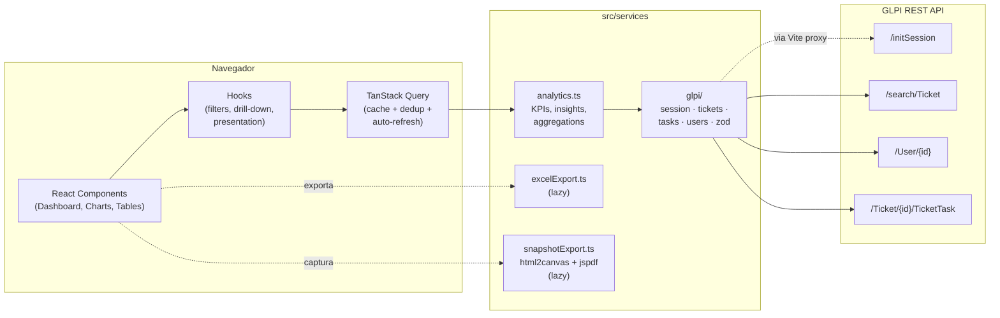

<div align="center">


# Central de Monitoramento de Chamados RPA

**Dashboard analítico em tempo real para a fila de chamados da equipe de RPA da Minerva Foods.**
Conectado direto à API do GLPI, com KPIs, insights, ações sugeridas, exportações executivas e modo TV para painel de parede.

<br/>

[](https://react.dev/)
[](https://www.typescriptlang.org/)
[](https://vitejs.dev/)
[](https://tailwindcss.com/)
[](https://tanstack.com/query)
[](https://recharts.org/)
[](https://zod.dev/)
[](https://web.dev/learn/pwa/)
[](https://github.com/exceljs/exceljs)
[](https://github.com/parallax/jsPDF)

[](#-licença)
[](#)
[](https://github.com/LeviCury/central-monitoramento-chamados-rpa)

</div>

---

## Sobre

Painel web que substitui planilhas e relatórios manuais. Lê tickets do **GLPI** em tempo real, calcula KPIs, gera **insights automáticos** e **próximas ações**, oferece **comparação lado a lado entre técnicos**, e fecha o ciclo com exportações de **PDF executivo**, **PNG do dashboard** e **Excel multi-abas**. Pensado para três cenários:

| Persona            | Como usa                                                            |
| ------------------ | ------------------------------------------------------------------- |
| **Coordenador**    | Acompanha KPIs do dia, age sobre chamados parados, distribui carga  |
| **Diretor/Gerente**| Recebe o resumo executivo (1 página, PDF) ou abre o link com filtro |
| **Time RPA**       | Painel de parede em modo TV rotativo (KPIs ↔ gráficos ↔ heatmap)    |

> [!NOTE]
> O dashboard **não inventa SLA**. Trabalha com indicadores honestos baseados nos dados reais do GLPI: chamados parados, taxa de resolução, planejado vs realizado, etc.

---

## Destaques

<table>
<tr>
<td width="50%" valign="top">

### Tempo real, sem fricção
- Direto na API GLPI (`/search/Ticket`, `/TicketTask`)
- TanStack Query: cache, dedup, refetch automático
- Auto-refresh a cada 20 minutos
- Sem race conditions

</td>
<td width="50%" valign="top">

### Insights e ações
- Geração automática de insights tonais (positivo / atenção / risco)
- Lista de "próximas ações" filtráveis com 1 clique
- Comparação lado a lado de até 4 técnicos
- Drill-down em qualquer gráfico

</td>
</tr>
<tr>
<td width="50%" valign="top">

### Saídas executivas
- **PDF Resumo Executivo** com legenda didática das %, breakdown por **Tipo** (Incidente / Requisição) e card "Em Aberto" com 3 linhas explicativas
- **PNG/PDF Snapshot** do dashboard
- **Excel** com 6 abas (Resumo, Chamados, Apontamentos, Por Técnico, Por Tipo, Insights & Ações)
- Copiar imagem para a área de transferência

</td>
<td width="50%" valign="top">

### Painel de parede
- Modo apresentação fullscreen (Ctrl+P)
- **Modo TV**: carrossel rotativo entre KPIs, evolução, planejado vs realizado, status, técnicos e heatmap
- Tema claro/escuro adaptativo
- PWA instalável

</td>
</tr>
</table>

---

## Quick Start

```bash
git clone https://github.com/LeviCury/central-monitoramento-chamados-rpa.git
cd central-monitoramento-chamados-rpa
npm install
cp .env.example .env      # preencha com suas credenciais GLPI
npm run dev               # http://localhost:5173
```

> [!TIP]
> Em 30 segundos você tem um dashboard rodando contra o GLPI. Veja [Variáveis de Ambiente](#variáveis-de-ambiente) para os tokens necessários.

---

## Sumário

- [Sobre](#sobre)
- [Destaques](#destaques)
- [Quick Start](#quick-start)
- [Funcionalidades](#funcionalidades)
- [Arquitetura](#arquitetura)
- [Stack](#stack)
- [Estrutura do Projeto](#estrutura-do-projeto)
- [Pré-requisitos](#pré-requisitos)
- [Instalação e Configuração](#instalação-e-configuração)
- [Variáveis de Ambiente](#variáveis-de-ambiente)
- [Scripts](#scripts)
- [Integração com GLPI](#integração-com-glpi)
- [Saídas do Dashboard](#saídas-do-dashboard)
- [Modos de Visualização](#modos-de-visualização)
- [Performance](#performance)
- [Deploy](#deploy)
- [Solução de Problemas](#solução-de-problemas)
- [Roadmap](#roadmap)
- [Desenvolvedores](#desenvolvedores)
- [Licença](#licença)

---

## Funcionalidades

### KPIs com comparativo

| KPI                    | O que mede                                                                                                              |
| ---------------------- | ----------------------------------------------------------------------------------------------------------------------- |
| **Total de Chamados**  | Total no período + Δ% vs período anterior equivalente · mini-pílulas `Inc N · Req N`                                    |
| **Taxa de Resolução**  | (fechados + solucionados) / total + Δ vs período anterior                                                               |
| **Chamados em Aberto** | 3 linhas didáticas: `em atendimento` (na nossa mão) · `pendentes` (aguardando externos) · `novos` (não atribuídos)      |
| **Chamados Parados**   | Em aberto há mais de `VITE_STALE_DAYS` dias (padrão `7`) · subtítulo `Inc N · Req N · Média Xd`                         |
| **Média de Horas**     | Média de horas trabalhadas por chamado **com apontamento**                                                              |
| **Saldo de Horas**     | Realizado − Planejado (KPI executivo de capacidade)                                                                     |

> [!NOTE]
> Quando há filtro de data ativo, **todos** os KPIs mostram comparativo automático com o período anterior de mesma duração. Os deltas são coloridos por sinal e tom (subir/cair pode ser bom ou ruim dependendo do KPI). O sinal aparece como `+X%` ou `-X%` (ASCII puro) — sem setas unicode que poderiam falhar no PDF.

### Mini-glossário dos estados

Esses termos aparecem nos KPIs, nos gráficos e no PDF executivo:

| Estado                      | Significado                                                                          |
| --------------------------- | ------------------------------------------------------------------------------------ |
| **Em atendimento (atribuído)** | Está com um técnico — **na nossa mão**                                            |
| **Pendente**                | Aguardando algo **externo** (cliente, fornecedor, outro time)                        |
| **Novo**                    | Criado mas ainda não foi atribuído a um técnico                                      |
| **Solucionado / Fechado**   | Finalizado                                                                           |
| **Parado**                  | Em aberto há mais de `VITE_STALE_DAYS` (padrão `7d`) — independe do estado interno   |

### Tipo de chamado (Incidente x Requisição)

Capturado do campo `14` do GLPI:

- **Incidente** (vermelho): algo quebrou na operação e precisa de correção
- **Requisição** (azul): solicitação, melhoria ou projeto

Mostrado em todo o dashboard como mini-pílulas, em um donut dedicado e como filtro chip. No PDF executivo aparece como uma seção própria "Por Tipo de Chamado" com taxa de resolução, parados e em aberto por tipo.

### Insights automáticos e ações sugeridas

Logo abaixo dos KPIs aparece o bloco **"Hoje no RPA"**:

- **Leitura rápida**: 3–5 frases curtas geradas a partir das métricas (ex.: *"Taxa de resolução em alta: +12% em 7 dias"*)
- **Próximas ações**: lista priorizada com botões "Filtrar →" que aplicam o filtro relevante no painel (ex.: *"3 chamados parados há mais de 7 dias — Filtrar"*)

### Gráficos interativos com drill-down

| Gráfico                       | Comportamento                                                          |
| ----------------------------- | ---------------------------------------------------------------------- |
| **Evolução de Chamados**      | Área diária + projeção dos próximos 7 dias (regressão linear)          |
| **Planejado x Realizado**     | Barras agrupadas por colaborador RPA                                   |
| **Distribuição por Status**   | Clique na barra ou legenda para filtrar pelo status                    |
| **Distribuição por Tipo**     | Donut Incidente x Requisição — clique na fatia para filtrar pelo tipo  |
| **Chamados por Técnico**      | Ranking horizontal — clique na barra para filtrar pelo técnico         |
| **Heatmap dia × hora**        | Identifica picos de demanda na semana                                  |

### Comparador de técnicos

Selecione até 4 técnicos e veja lado a lado:

- Total no período · em aberto · finalizados
- Taxa de fechamento · chamados parados · média de dias em aberto
- Horas realizadas · média de horas por chamado

Útil em 1:1, distribuição de carga e revisão de capacidade.

### Filtros avançados

- **Período**: filtros rápidos (Hoje, 7d, 30d, este/último mês) + intervalo manual
- **Status, Prioridade, Técnico, Tipo**: seleção múltipla. O filtro **Tipo** (Incidente/Requisição) é client-side e atualiza KPIs, gráficos e tabela em tempo real
- **Drill-down** clicando em qualquer gráfico
- **URL compartilhável**: filtros viram query params (`?start=...&status=Pendente&type=incidente`) — copie o link e mande no Teams
- **Presets**: salva combinações nomeadas no `localStorage`, aplica com 1 clique
- **Multi-grupo**: seletor no header quando há múltiplos grupos configurados (`VITE_GLPI_GROUPS`)

### Tabela com ordenação e ações

- Ordenação clicável por qualquer coluna (ID, título, status, técnico, horas, data)
- Busca em tempo real (ID, título, técnico)
- Paginação automática
- Link direto para o chamado no GLPI
- Badges de status coloridos
- **Badge "Parado há Xd"** aparece automaticamente quando o limiar é ultrapassado
- Painel lateral com detalhes + apontamentos por colaborador

### Outros recursos

- **Tema claro/escuro** com detecção automática do sistema, persistência em `localStorage` e logos adaptativas
- **Toaster** discreto para feedback de refresh, exportação e erros
- **ErrorBoundary** global com tela de fallback elegante
- **PWA**: instalável no desktop (Chrome/Edge), cache offline de assets, manifest com tema da Minerva
- **Acessibilidade**: ARIA labels, roles, sort, navegação por teclado nos elementos interativos
- **Modo apresentação** (Ctrl+P) com KPIs ampliados e **Modo TV** rotativo (atalho **T**)

---

## Arquitetura



### Fluxo de dados

1. **Filtros do usuário** → `useDashboardFilters` (sincroniza com URL e `localStorage`)
2. **`useGLPITickets`** dispara `fetchTickets()` via TanStack Query (cache, dedup, auto-refresh)
3. **`fetchTickets()`** monta os critérios e chama `glpi/tickets.ts` → `POST /search/Ticket`
4. **`glpi/tasks.ts`** busca apontamentos em paralelo (`/Ticket/{id}/TicketTask`) e separa por colaborador RPA da allowlist
5. **`analytics.ts`** calcula métricas, insights, ações, comparativo de período anterior, heatmap, forecast
6. **Componentes** consomem o estado memoizado e renderizam os gráficos/cards/tabela
7. **Exportações** (Excel/PNG/PDF) usam módulos lazy carregados sob demanda

---

## Stack

### Runtime

| Tecnologia              | Versão  | Papel                                              |
| ----------------------- | ------- | -------------------------------------------------- |
| **React**               | 18.3.1  | UI declarativa                                     |
| **TypeScript**          | 5.5.3   | Tipagem estática                                   |
| **Vite**                | 5.4.8   | Build / dev server / proxy GLPI                    |
| **TailwindCSS**         | 3.4.1   | Estilo utilitário                                  |
| **TanStack Query**      | 5.59    | Data fetching, cache e dedup                       |
| **Zod**                 | 3.23    | Validação runtime das respostas do GLPI            |
| **Recharts**            | 3.7.0   | Gráficos interativos                               |
| **Lucide React**        | 0.344   | Ícones                                             |
| **ExcelJS + FileSaver** | 4.4 / 2 | Geração e download de `.xlsx` (lazy)               |
| **html2canvas**         | 1.4.1   | Snapshot DOM → canvas (lazy)                       |
| **jsPDF**               | 2       | Geração de PDF (lazy)                              |
| **vite-plugin-pwa**     | 0.20.5  | Service worker + manifest PWA                      |

### Desenvolvimento

| Ferramenta             | Para que serve                |
| ---------------------- | ----------------------------- |
| **ESLint**             | Lint                          |
| **TypeScript ESLint**  | Regras TS                     |
| **PostCSS**            | Pipeline CSS do Tailwind      |
| **Autoprefixer**       | Prefixos CSS automáticos      |

---

## Estrutura do Projeto

```text
central-monitoramento-chamados-rpa/
│
├── index.html                    # HTML principal
├── package.json
├── vite.config.ts                # Vite + proxy GLPI + PWA
├── tailwind.config.js
├── tsconfig.json
├── .env.example
│
├── public/
│   ├── favicon.png
│   └── icons/
│       └── icon.svg              # Ícone PWA mascarável
│
└── src/
    ├── main.tsx                  # QueryClientProvider + ErrorBoundary + Toaster
    ├── App.tsx                   # ThemeProvider
    ├── config.ts                 # Variáveis de ambiente tipadas
    ├── index.css
    │
    ├── components/
    │   ├── Dashboard.tsx                 # Orquestrador
    │   ├── DashboardHeader.tsx           # Cabeçalho + multi-grupo + ações
    │   ├── KPICard.tsx · KPIGrid.tsx     # Cards e grid responsivo de KPIs
    │   ├── InsightsBlock.tsx             # "Hoje no RPA": insights + ações
    │   ├── TimelineChart.tsx             # Evolução + forecast 7 dias
    │   ├── PlannedVsRealizedChart.tsx
    │   ├── StatusChart.tsx               # com drill-down
    │   ├── TechnicianChart.tsx           # com drill-down
    │   ├── Heatmap.tsx                   # dia × hora
    │   ├── TechniciansCompare.tsx        # comparador lado a lado
    │   ├── TicketTable.tsx               # ordenação + badge "parado há Xd"
    │   ├── TicketDetailPanel.tsx         # painel lateral
    │   ├── TicketFilterPanel.tsx
    │   ├── PresetsBar.tsx                # salvar/aplicar presets
    │   ├── PresentationCarousel.tsx      # modo TV
    │   ├── ShareMenu.tsx                 # PDF executivo · PNG · PDF · copiar
    │   ├── ErrorBoundary.tsx
    │   └── Toaster.tsx
    │
    ├── hooks/
    │   ├── useGLPITickets.ts             # TanStack Query (tickets + horas)
    │   ├── useDashboardFilters.ts        # filtros + URL + presets + multi-grupo
    │   ├── usePresentationMode.ts        # fullscreen + modo TV + atalhos
    │   ├── useTimeAgo.ts                 # "há X minutos"
    │   ├── useDrillDown.ts               # cliques nos gráficos → filtros
    │   └── useToasts.ts
    │
    ├── contexts/
    │   ├── ThemeContext.tsx              # provider claro/escuro
    │   └── useTheme.ts
    │
    ├── services/
    │   ├── analytics.ts                  # métricas, parados, forecast,
    │   │                                 # deltas, heatmap, insights, ações
    │   ├── excelExport.ts                # Excel multi-abas (lazy)
    │   ├── snapshotExport.ts             # PNG / PDF snapshot / PDF executivo (lazy)
    │   │
    │   └── glpi/                         # Cliente GLPI modular
    │       ├── index.ts                  # barrel
    │       ├── session.ts                # initSession + glpiFetch + 401 retry
    │       ├── tickets.ts                # /search/Ticket + critérios
    │       ├── tasks.ts                  # /TicketTask + apontamentos
    │       ├── users.ts                  # /User + allowlist colaboradores RPA
    │       ├── constants.ts              # FIELDS, STATUS_MAP, PRIORITY_MAP
    │       └── schemas.ts                # Validação Zod das respostas
    │
    ├── types/
    │   └── index.ts                      # Ticket, FilterState, etc.
    │
    └── utils/
        └── timeFormat.ts                 # formatHoursMinutes
```

---

## Pré-requisitos

- **Node.js** 18 ou superior
- **npm** ou **yarn**
- Acesso à rede interna da Minerva Foods (ou um proxy ao GLPI)
- Tokens da API GLPI (`App-Token` + `Authorization Basic`)

---

## Instalação e Configuração

### 1. Clone

```bash
git clone https://github.com/LeviCury/central-monitoramento-chamados-rpa.git
cd central-monitoramento-chamados-rpa
```

### 2. Instale as dependências

```bash
npm install
```

### 3. Configure o `.env`

```bash
cp .env.example .env
```

Edite o arquivo `.env` com suas credenciais (veja a próxima seção).

### 4. Rode

```bash
npm run dev
```

Abra `http://localhost:5173`.

---

## Variáveis de Ambiente

```env
# === Credenciais GLPI ===
VITE_GLPI_AUTH_BASIC=base64(usuario:senha)
VITE_GLPI_APP_TOKEN=seu_app_token_aqui

# === Filtros de fila ===
# Entidade GLPI (campo 80). DEIXE VAZIO se você só quer filtrar por grupo
# (caso comum: o ID que você conhece é o do grupo técnico, não da entidade).
VITE_GLPI_ENTITY_ID=

# Grupo técnico GLPI (campo 8). Coloque aqui o ID do seu grupo no GLPI.
# Descubra o ID real em: GLPI → Administração → Grupos → passe o mouse
# sobre o grupo (a URL mostra ?id=NN) ou abra o grupo e veja na URL.
VITE_GLPI_GROUP_ID=ID_DO_GRUPO

# Lista de grupos disponíveis no seletor multi-grupo (id:nome|id:nome).
# O primeiro é o padrão. Os IDs abaixo são fictícios — substitua pelos seus.
VITE_GLPI_GROUPS=ID_DO_GRUPO:Nome do Grupo|OUTRO_ID:Outro Grupo

# === Equipe RPA ===
# Apontamentos só são contabilizados se o autor estiver nesta lista.
# Sintaxe: "Nome Canônico,Alias 1,Alias 2|Outro Nome".
VITE_RPA_COLLABORATORS=Nome Sobrenome|Outro Nome,Variante Do Nome

# === Indicadores ===
# Quantos dias em aberto um chamado precisa para virar "Chamado Parado".
VITE_STALE_DAYS=7
```

| Variável                  | Obrigatória | Descrição                                                                                                       |
| ------------------------- | :---------: | --------------------------------------------------------------------------------------------------------------- |
| `VITE_GLPI_AUTH_BASIC`    |     Sim     | Token Basic em Base64 (`base64(usuario:senha)`) para criar sessão no GLPI                                        |
| `VITE_GLPI_APP_TOKEN`     |     Sim     | App-Token gerado em *GLPI → Configurar → Geral → API*                                                            |
| `VITE_GLPI_GROUP_ID`      |     Não     | ID do grupo técnico (campo 8). Use `under` no GLPI: pega o grupo e seus subgrupos                                |
| `VITE_GLPI_ENTITY_ID`     |     Não     | ID da entidade (campo 80). Vazio = não filtrar por entidade. Útil quando o GLPI separa por unidade organizacional|
| `VITE_GLPI_GROUPS`        |     Não     | `id:nome|id:nome|...` para o seletor multi-grupo. O primeiro vira default                                        |
| `VITE_RPA_COLLABORATORS`  |     Não     | Allowlist de colaboradores cujas tasks são contabilizadas. Aliases por vírgula                                   |
| `VITE_STALE_DAYS`         |     Não     | Limite (em dias) para classificar um chamado em aberto como "parado". Padrão `7`                                  |

> [!WARNING]
> **Nunca commite o `.env`.** Ele já está no `.gitignore`. As variáveis `VITE_*` são embutidas no bundle final, então qualquer pessoa com acesso ao site lê os tokens. Em produção exposta externamente, considere um proxy backend que mantenha as credenciais server-side.

> [!TIP]
> Se o número total de chamados aparecer muito alto (ex.: bate em 2.001), o filtro de fila não está casando.
> Veja [Solução de Problemas](#solução-de-problemas).

---

## Scripts

| Comando               | O que faz                                                |
| --------------------- | -------------------------------------------------------- |
| `npm run dev`         | Sobe o dev server em `http://localhost:5173` com HMR     |
| `npm run build`       | Build de produção em `dist/`                             |
| `npm run preview`     | Servidor local servindo o `dist/`                        |
| `npm run lint`        | ESLint em todo o projeto                                 |
| `npm run typecheck`   | `tsc --noEmit` (não emite arquivos, só verifica tipos)   |

---

## Integração com GLPI

### Endpoints utilizados

| Método | Endpoint                       | Para quê                                          |
| :----: | ------------------------------ | ------------------------------------------------- |
| `GET`  | `/initSession`                 | Cria sessão e devolve `session_token`             |
| `POST` | `/search/Ticket`               | Busca chamados com critérios                      |
| `GET`  | `/User/{id}`                   | Resolve nome do técnico/solicitante               |
| `GET`  | `/Ticket/{id}/TicketTask`      | Lista apontamentos de horas do chamado            |

### Fluxo de autenticação

```text
1. GET /initSession
   Headers: Authorization: Basic <base64>, App-Token: <token>
   → { session_token }

2. POST /search/Ticket
   Headers: Session-Token, App-Token
   Body: { criteria: [...], range: "0-2000", forcedisplay: [...] }
```

A sessão é cacheada em memória e renovada automaticamente em respostas `401`.

### Critérios de busca

```ts
{
  criteria: [
    // (opcional) entidade — campo 80
    { link: 'AND', field: 80, searchtype: 'under', value: 'ID_DA_ENTIDADE' },

    // grupo técnico — campo 8 — usar `under` em vez de `equals`
    { link: 'AND', field: 8,  searchtype: 'under', value: 'ID_DO_GRUPO' },

    // datas, status, prioridade...
  ]
}
```

> [!IMPORTANT]
> **Use `searchtype: 'under'`** para entidade e grupo. Em algumas instalações do GLPI, `equals` é silenciosamente ignorado e a API devolve o universo inteiro até bater no teto do `range` (`0-2000`, ou seja, 2001 itens). Sintoma típico: o número total fica exatamente 2001 mesmo quando a sua fila tem muito menos.

### Proxy de desenvolvimento

`vite.config.ts` faz proxy de `/api/glpi/*` para `https://central.minervafoods.com/apirest.php` evitando CORS no dev.

```ts
server: {
  proxy: {
    '/api/glpi': {
      target: 'https://central.minervafoods.com/apirest.php',
      changeOrigin: true,
      rewrite: (path) => path.replace(/^\/api\/glpi/, ''),
    },
  },
}
```

---

## Saídas do Dashboard

Use o botão **"Compartilhar"** no header. Todas as opções carregam suas dependências sob demanda (`html2canvas`, `jspdf`, `exceljs`).

| Saída                     | Formato     | Como é gerada                                                                             |
| ------------------------- | ----------- | ----------------------------------------------------------------------------------------- |
| **Resumo Executivo**      | PDF A4      | Gerado programaticamente (jsPDF puro) com layout de relatório executivo Minerva           |
| **Dashboard como PDF**    | PDF A4      | Captura visual com **paginação automática** — preserva legibilidade em múltiplas páginas  |
| **Dashboard como PNG**    | PNG (3x DPI) | Captura em alta resolução com fundo sólido                                                |
| **Copiar imagem**         | Clipboard   | Copia o PNG para a área de transferência (cola direto no Teams/e-mail)                    |
| **Excel completo**        | XLSX        | 4 abas — Resumo, Por Técnico, Por Status, Insights & Ações                                |

### Resumo Executivo (PDF) — anatomia

Pensado para enviar a diretores/gerentes ou imprimir. Identidade visual Minerva, sem screenshot — tudo desenhado dos dados.

**Página 1 — Visão geral**

- **Header**: ribbon Minerva red + bloco navy com eyebrow `MINERVA FOODS · DOCUMENTO INTERNO`, título "Resumo Executivo" e bloco direito com `PERÍODO` e `GERADO EM`
- **Hero**: bloco navy escuro com:
  - Total de chamados em destaque
  - Delta vs período anterior (`+X%` em verde / `-X%` em vermelho — **sem setas unicode**, só ASCII puro pra renderizar igual em qualquer fonte)
  - 3 pílulas: `em aberto` · `finalizados` · `parados`
- **Faixa didática** logo abaixo do hero explicando como ler as variações em % (`+X%` subiu · `-X%` caiu · cor verde = direção desejada)
- **6 KPIs** (3×2) com borda lateral colorida, título small caps, valor grande e badge de delta no canto superior direito. O card **"Em Aberto"** mostra 3 mini-linhas explicativas:
  - `N em atendimento` — *na nossa mão*
  - `N pendentes` — *aguardando externos (cliente / fornecedor)*
  - `N novos` — *ainda não atribuídos*
  Os cards **"Total"**, **"Em Aberto"** e **"Parados"** ainda exibem mini-pílulas `Inc N · Req N` no rodapé
- **Distribuição por Status**: barras horizontais coloridas com `count · %`
- **Por Tipo de Chamado**: 2 colunas (Incidentes vermelho · Requisições azul) com total, `% do total`, em aberto, parados e taxa de resolução
- **Top 5 Técnicos**: barras horizontais com paleta variada

**Página 2 — Análise**

- Header navy simplificado
- `LEITURA RÁPIDA`: insights em cards tonais (verde/âmbar/vermelho/cinza)
- `PRÓXIMAS AÇÕES`: cards com painel lateral colorido `ALTA`/`MÉDIA`/`BAIXA`, contagem em destaque, título e descrição

**Footer (todas as páginas)**

- Linha divisora + `Central de Monitoramento RPA · Minerva Foods` + `Página X / Y`

> [!NOTE]
> Versões anteriores usavam `▲`/`▼` para os deltas, mas o Helvetica embutido no jsPDF não tem esses glifos e renderizava lixo (`%²`, `%¼`). Trocamos por `+` e `-` ASCII; cor + sinal já comunicam direção.

### Snapshot do Dashboard

- **PDF**: paginação automática em A4 retrato (em vez de comprimir tudo numa página) — cada página com header navy/vermelho e footer com paginação
- **PNG**: scale 3× e fundo sólido `#0F172A`
- **Copiar imagem**: idem PNG, mas direto na área de transferência

### Excel — abas geradas

| Aba                  | Conteúdo                                                                                          |
| -------------------- | ------------------------------------------------------------------------------------------------- |
| **Resumo Executivo** | KPIs principais formatados, com cores e destaques                                                 |
| **Chamados**         | Lista completa de chamados com coluna **Tipo** (Incidente/Requisição), status colorido e horas    |
| **Apontamentos**     | Apontamentos por chamado e colaborador (planejado · realizado · legado) com horas                 |
| **Por Técnico**      | Total · em aberto · finalizados · taxa fechamento · parados · média dias · horas                  |
| **Por Tipo**         | Total · em atendimento · pendente · novo · finalizados · parados · taxa de resolução por tipo + glossário |
| **Insights & Ações** | Insights tonais e lista de próximas ações com severidade                                          |

---

## Modos de Visualização

### Modo Apresentação

Atalho: **Ctrl + P** (sai com **Esc**).

- Fullscreen
- KPIs ampliados
- Tipografia maior
- Toolbar minimizada

### Modo TV (carrossel)

Dentro da apresentação, atalho: **T**.

Slideshow rotativo a cada 12 segundos:

```
KPIs → Evolução → Planejado x Realizado → Status & Técnicos → Heatmap → KPIs ...
```

Perfeito para um monitor fixo na parede da equipe.

### PWA

No Chrome/Edge aparece o ícone "Instalar" na barra de endereço. Instalado, abre como app nativo, com cache offline de assets e fontes.

---

## Performance

| Item                                | Valor                                                              |
| ----------------------------------- | ------------------------------------------------------------------ |
| **Bundle inicial (gzip)**           | ~213 KB (chunk principal) + 7,5 KB (CSS)                            |
| **Lazy chunks**                     | `excelExport` (~275 KB gz), `snapshotExport` (~179 KB gz)           |
| **Cache de sessão GLPI**            | 30 minutos em memória, com renovação automática em 401              |
| **Refetch automático**              | A cada 20 minutos (configurável em `config.ui.autoRefreshMinutes`)  |
| **Dedup de requisições idênticas**  | Garantido pelo TanStack Query                                       |

> [!NOTE]
> A primeira interação com Excel/PDF/PNG demora ~300 ms a mais (download do chunk lazy). Depois disso, fica em cache.

---

## Deploy

| Plataforma            | Recomendação                                                              |
| --------------------- | ------------------------------------------------------------------------- |
| **Vercel**            | Recomendado — integração direta com GitHub, build automático em cada push |
| **Netlify**           | Igualmente simples, com configuração via UI                               |
| **Cloudflare Pages**  | Muito rápido e gratuito                                                   |
| **GitHub Pages**      | Funciona, mas exige base path configurado                                 |
| **IIS / nginx**       | Para deploy interno na Minerva — sirva o `dist/` como SPA fallback        |

### Deploy no Vercel em 4 cliques

1. Acesse [vercel.com](https://vercel.com) e logue com GitHub
2. *Import Project* → selecione o repositório
3. Configure as variáveis de ambiente (`VITE_GLPI_*`, etc.) em *Settings → Environment Variables*
4. *Deploy*

> [!WARNING]
> **CORS em produção**: a API GLPI precisa permitir requisições do domínio do deploy. Se isso não for possível, mantenha o painel atrás da rede interna ou implante um proxy backend.

---

## Solução de Problemas

<details>
<summary><b>O painel mostra exatamente 2001 chamados (ou um número próximo desse teto)</b></summary>
<br/>

O filtro de fila não está casando — o GLPI está devolvendo o universo até bater o teto do `range` (`0-2000`).

**Diagnóstico**: abra o DevTools → Console e procure por:

```
[GLPI] Buscando tickets com critérios: { ... }
[GLPI] Atenção: 2001 tickets retornados ...
```

**Causas comuns:**

1. `searchtype: 'equals'` está sendo ignorado pelo seu GLPI → use `'under'` (já é o padrão atual)
2. `VITE_GLPI_GROUP_ID` aponta para um ID inexistente
3. `VITE_GLPI_ENTITY_ID` está preenchido com um ID que não é entidade → deixe **vazio** se você só conhece o ID do grupo

</details>

<details>
<summary><b>Erro de CORS em produção</b></summary>
<br/>

A API GLPI bloqueia requisições do domínio. Soluções:

1. **Configurar CORS no GLPI** para aceitar o domínio do deploy
2. **Implantar atrás de um proxy** (nginx, Cloudflare Worker) que adicione os headers
3. **Manter na rede interna** com acesso direto à API

</details>

<details>
<summary><b>Sessão GLPI expira o tempo todo</b></summary>
<br/>

A duração padrão é 30 minutos (em memória). Se o seu GLPI expira antes, ajuste em `src/config.ts`:

```ts
sessionDurationMs: 15 * 60 * 1000  // 15 minutos
```

A renovação acontece automaticamente em respostas `401`.

</details>

<details>
<summary><b>Apontamentos de um colaborador não aparecem</b></summary>
<br/>

Verifique se o nome dele está em `VITE_RPA_COLLABORATORS`. A normalização ignora acentos, capitalização e espaços, mas variantes precisam estar como aliases:

```env
VITE_RPA_COLLABORATORS=João da Silva,Joao Silva,J. Silva|Maria Souza
```

</details>

<details>
<summary><b>O Excel/PDF demora ao primeiro clique</b></summary>
<br/>

Esperado. Os módulos `exceljs`, `html2canvas` e `jspdf` são carregados sob demanda para reduzir o bundle inicial. Após o primeiro clique fica em cache.

</details>

<details>
<summary><b>Os deltas de % aparecem com valores enormes (ex.: +1135%)</b></summary>
<br/>

É matemática real, não bug. Quando o período anterior tem uma base muito pequena (ex.: 1 chamado), qualquer aumento dispara um % alto. O dashboard sempre mostra o número absoluto também — confie nele.

</details>

---

## Roadmap

- [ ] Backend proxy para tirar tokens GLPI do bundle
- [ ] Webhooks para notificar Teams/Slack quando aparecer chamado parado
- [ ] Autenticação SSO (Azure AD)
- [ ] Histórico semanal/mensal persistido para tendências de longo prazo
- [ ] Painel customizável (drag & drop dos cards)
- [ ] Exportação agendada (e-mail diário com PDF executivo)

---

## Desenvolvedores

<table>
<tr>
<td align="center" width="50%">
<a href="https://www.linkedin.com/in/levicury/" target="_blank">
<strong>Levi Cury</strong>
</a>
<br/>
<sub>Desenvolvedor RPA · Minerva Foods</sub>
<br/>
<a href="https://www.linkedin.com/in/levicury/" target="_blank">

</a>
<a href="https://github.com/LeviCury" target="_blank">

</a>
</td>
<td align="center" width="50%">
<a href="https://www.linkedin.com/in/igor-minuncio/" target="_blank">
<strong>Igor Martins Minuncio</strong>
</a>
<br/>
<sub>Desenvolvedor RPA · Minerva Foods</sub>
<br/>
<a href="https://www.linkedin.com/in/igor-minuncio/" target="_blank">

</a>
</td>
</tr>
</table>

---

## Licença

Projeto interno da **Minerva Foods S.A.**

© 2026 Minerva Foods S.A. — Todos os direitos reservados.

---

<div align="center">


<sub>Equipe de RPA · Minerva Foods</sub>

</div>
