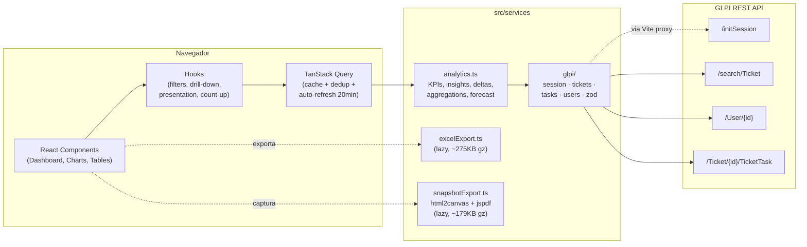

<div align="center">

<br/>


<br/>
<br/>

# Central de Monitoramento de Chamados RPA

### Um dashboard que troca planilha por clareza.

Painel analítico em tempo real para a fila de chamados da equipe de **RPA da Minerva Foods**.
Conectado direto à API do GLPI, com KPIs escultóricos, insights gerados a partir dos dados,
exportações executivas e modo TV para o monitor da parede.
Nada inventado. Nada exagerado. **Apenas o que importa, lindamente apresentado.**

<br/>

[](https://react.dev/)
[](https://www.typescriptlang.org/)
[](https://vitejs.dev/)
[](https://tailwindcss.com/)

[](https://tanstack.com/query)
[](https://recharts.org/)
[](https://zod.dev/)
[](https://web.dev/learn/pwa/)
[](https://github.com/exceljs/exceljs)
[](https://github.com/parallax/jsPDF)

[](#-licença)
[](#)
[](#-design-system)
[](https://github.com/LeviCury/central-monitoramento-chamados-rpa)

<br/>

[**Demo ao vivo**](https://rpatickets.vercel.app) · [**Quick Start**](#-quick-start) · [**Design System**](#-design-system) · [**Documentação**](#-funcionalidades)

</div>

---

## Filosofia

> Um dashboard de operação não precisa ser bonito.
> Mas se ele **for** — a equipe abre. Se a equipe abre, a equipe age.
> Se a equipe age, a operação melhora.
>
> Beleza, aqui, é função.

Este projeto é construído sobre quatro princípios:

| Princípio                         | Como se traduz no código                                                                |
| --------------------------------- | --------------------------------------------------------------------------------------- |
| **Honestidade dos dados**         | Sem SLA inventado. Indicadores derivados direto do GLPI: parados, taxa, planejado/real. |
| **Hierarquia tipográfica**        | Números gritam. Labels sussurram. `tracking-tightest`, `tnum`, `font-feature-settings`. |
| **Cor como acento, não cenário**  | Fundo neutro `#fafafa` / `#09090b`. O vermelho Minerva aparece só onde tem significado. |
| **Performance é UX**              | Lazy chunks de export, animações em `transform/opacity`, `prefers-reduced-motion`.      |

---

## Sumário

<table>
<tr>
<td valign="top">

**Pra usar**
- [Demo ao vivo](#demo-ao-vivo)
- [Quick Start](#-quick-start)
- [Funcionalidades](#-funcionalidades)
- [Modos de visualização](#-modos-de-visualização)
- [Saídas executivas](#-saídas-executivas)

</td>
<td valign="top">

**Pra entender**
- [Design System](#-design-system)
- [Arquitetura](#-arquitetura)
- [Stack](#-stack)
- [Estrutura do projeto](#-estrutura-do-projeto)
- [Integração com GLPI](#-integração-com-glpi)

</td>
<td valign="top">

**Pra operar**
- [Variáveis de ambiente](#-variáveis-de-ambiente)
- [Scripts](#-scripts)
- [Performance](#-performance)
- [Deploy](#-deploy)
- [Solução de problemas](#-solução-de-problemas)

</td>
</tr>
</table>

---

## Demo ao vivo

🌐 **<https://rpatickets.vercel.app>** *(requer VPN Minerva ou CORS liberado no GLPI — veja [Deploy](#-deploy)).*

**Personas e como cada uma usa:**

| Persona              | Como usa o painel                                                                  |
| -------------------- | ---------------------------------------------------------------------------------- |
| **Coordenador**      | Acompanha KPIs do dia, age sobre chamados parados, distribui carga                 |
| **Diretor / Gerente**| Recebe o **Resumo Executivo** (1 página, PDF) ou abre o link com filtros aplicados |
| **Time RPA**         | Painel de parede em **Modo TV** rotativo — KPIs ↔ gráficos ↔ heatmap               |
| **Analista**         | Abre o **Excel** com 6 abas pra cruzar dados a frio, fora do dashboard             |

> [!NOTE]
> **O dashboard não inventa SLA.** Trabalha com indicadores honestos baseados nos dados reais
> do GLPI: chamados parados, taxa de resolução, planejado vs realizado, mix incidente/requisição.

---

## ✨ Design System

Este painel passou por uma **reformulação visual radical** mirando o nível Apple/Linear/Stripe:
fundo neutro, tipografia escultórica, glass realmente sutil, sombras quase imperceptíveis e
cor como acento pontual — não como cenário. Tudo continua respeitando a marca Minerva.

### Princípios

```
1.  Fundo neutro       → near-white  #fafafa  ·  near-black  #09090b
                          (1 radial vermelho a 3% no canto, só pra dar vida)
2.  Tipografia         → números em font-semibold + tracking-[-0.04em], labels uppercase
                          em text-[10px] tracking-[0.14em]
3.  Sombras            → 3 níveis (subtle / soft / lifted) — todas <12% de opacidade
4.  Cor                → vermelho Minerva (#F84454) só em ações de marca
                          (botão primário, live-dot, hovers de remoção)
5.  Glass real         → backdrop-blur(20px) saturate(180%) só onde precisa
                          (header sticky, drawer, tooltips)
6.  Movimento          → transform/opacity apenas, ease-out-expo, ≤200ms
                          respeita prefers-reduced-motion sempre
```

### Tokens

<table>
<tr>
<td width="50%" valign="top">

#### Paleta neutra `ink-*`

```css
--bg-base:      #fafafa  /  #09090b
--bg-elevated:  #ffffff  /  #131316
--bg-subtle:    #f4f4f5  /  #1a1a1d

--text-primary:    #18181b  /  #fafafa
--text-secondary:  #52525b  /  #a0a0a8
--text-tertiary:   #a0a0a8  /  #71717a

--border-subtle:  rgb(0 0 0 / 0.06)  /  rgb(255 255 255 / 0.05)
--border-default: rgb(0 0 0 / 0.08)  /  rgb(255 255 255 / 0.08)
```

</td>
<td width="50%" valign="top">

#### Tipografia escultórica

```css
font: 'Inter', system-ui, -apple-system, sans-serif
font-feature-settings: 'cv11', 'ss01', 'ss03'

/* Títulos: tracking negativo, peso 600 */
text-[22px]  tracking-[-0.02em]   font-semibold
text-[44px]  tracking-[-0.04em]   font-semibold  /* KPI normal */
text-[64px]  tracking-[-0.05em]   font-semibold  /* KPI grande */

/* Labels: uppercase pequeno */
text-[10px]  tracking-[0.14em]    uppercase  font-semibold

/* Números: tabular */
font-variant-numeric: tabular-nums
```

</td>
</tr>
<tr>
<td valign="top">

#### Sombras Apple-style

```css
--shadow-subtle:
  0 1px 2px  rgb(0 0 0 / .04),
  0 1px 1px  rgb(0 0 0 / .02);

--shadow-soft:
  0 4px 16px -4px rgb(15 23 42 / .06),
  0 2px 6px  -2px rgb(15 23 42 / .04);

--shadow-lifted:
  0 16px 40px -12px rgb(15 23 42 / .10),
  0 6px 16px  -4px rgb(15 23 42 / .06);
```

</td>
<td valign="top">

#### Glass real

```css
.glass {
  background: rgb(255 255 255 / 0.65);
  backdrop-filter: blur(20px) saturate(180%);
  border: 1px solid var(--border-subtle);
}

.glass-strong {  /* tooltips, drawer */
  background: rgb(255 255 255 / 0.85);
  backdrop-filter: blur(24px) saturate(180%);
}
```

</td>
</tr>
</table>

### Antes × Depois

| Aspecto              | Antes (Executive Premium)                              | Depois (Apple-grade)                              |
| -------------------- | ------------------------------------------------------ | ------------------------------------------------- |
| **Fundo**            | Mesh roxo + vermelho cobrindo a tela                   | Neutro near-white/near-black + 1 radial 3%        |
| **KPIs**             | Glass com overlay colorido vazando, número `text-3xl`  | Glass invisível, número `text-[44px]` escultórico |
| **Sombras**          | `shadow-glow-red`, `shadow-glow-emerald`, etc.         | 3 níveis sutis, todos < 12% de opacidade          |
| **Bordas dos cards** | `lit-border` rotativo no hover (efeito RGB)            | `ring-1 ring-black/6` estático, refinado          |
| **Toaster**          | Fundo tonal forte + ícone `9×9` colorido               | Glass-strong neutro + ícone `7×7` discreto        |
| **Tabela**           | Header navy gradient, badges com `border + bg-50`      | Header neutro com glass sticky, badges sem borda  |
| **Filtros tabela**   | Apenas search global                                   | Popover Excel-style por coluna (Tipo/Status/Téc.) |
| **Filtros**          | Caixas com borda visível, accent colorido por seção    | Divisores `border-b` sutis, monocromático         |
| **Drawer**           | Header navy gradient + glow no botão fechar            | Glass-strong neutro, botão fechar ghost           |

> [!TIP]
> Quer ver o salto na prática? Compare o último commit (`feat(ui): apple-grade redesign`) com o
> anterior. Toda a fundação está em `tailwind.config.js`, `src/index.css` e
> `src/components/charts/chartTheme.tsx`.

---

## 🚀 Quick Start

```bash
git clone https://github.com/LeviCury/central-monitoramento-chamados-rpa.git
cd central-monitoramento-chamados-rpa
npm install
cp .env.example .env      # preencha com suas credenciais GLPI
npm run dev               # http://localhost:5173
```

> [!TIP]
> Em **30 segundos** você tem um dashboard rodando contra o GLPI.
> Veja [Variáveis de Ambiente](#-variáveis-de-ambiente) para os tokens necessários.

---

## ✨ Funcionalidades

### KPIs (grid 3×2)

Seis cards, cada um com **um propósito claro** e — quando faz sentido — comparação com o
período anterior equivalente:

| KPI                    | O que mede                                                                                                              | Tipo       |
| ---------------------- | ----------------------------------------------------------------------------------------------------------------------- | ---------- |
| **Total de Chamados**  | Total no período + Δ% vs período anterior · mini-pílulas `Incidente N · Requisição N`                                   | comparado  |
| **Taxa de Resolução**  | `Finalizados / Total` (ex.: `48 de 57`) + porcentagem como subtítulo + Δ vs período anterior                            | comparado  |
| **Chamados em Aberto** | 3 linhas didáticas: `em atendimento` (na nossa mão) · `pendentes` (aguardando externos) · `novos` (não atribuídos)      | snapshot   |
| **Média de Horas**     | Média de horas trabalhadas por chamado **com apontamento** (formato `Xh Ym`)                                            | snapshot   |
| **Saldo de Horas**     | `Realizado − Planejado` — KPI executivo de capacidade (verde = ganho · vermelho = déficit)                              | snapshot   |
| **Mix do Período**     | Proporção `Incidente vs Requisição` — valor = % da categoria dominante · mini-barra segmentada + breakdown numérico     | snapshot   |

> [!NOTE]
> **Comparado** = exibe Δ vs período anterior de mesma duração (`+X%` verde · `-X%` vermelho).
> **Snapshot** = só faz sentido o número atual; comparar período a período seria enganoso
> (ex.: % de incidentes do mês passado não diz nada se o volume mudou).

### Glossário dos estados

Esses termos aparecem nos KPIs, nos gráficos e no PDF executivo:

| Estado                         | Significado                                                                          |
| ------------------------------ | ------------------------------------------------------------------------------------ |
| **Em atendimento (atribuído)** | Está com um técnico — **na nossa mão**                                               |
| **Pendente**                   | Aguardando algo **externo** (cliente, fornecedor, outro time)                        |
| **Novo**                       | Criado mas ainda não foi atribuído a um técnico                                      |
| **Solucionado / Fechado**      | Finalizado                                                                           |
| **Parado**                     | Em aberto há mais de `VITE_STALE_DAYS` (padrão `7d`) — independe do estado interno   |

### Tipo de chamado (Incidente × Requisição)

Capturado do **campo `14`** do GLPI:

- 🔴 **Incidente** — algo quebrou na operação e precisa de correção
- 🔵 **Requisição** — solicitação, melhoria ou projeto

Mostrado em todo o dashboard como mini-pílulas, em um donut dedicado e como filtro chip.
No KPI **Mix do Período**, o time vê de relance se está apagando incêndio (incidentes dominam)
ou tocando projeto (requisições dominam) — com mini-barra segmentada e headline contextual.

### "Hoje no RPA" — insights e ações

Logo abaixo dos KPIs aparece o bloco de leitura do dia:

- **Leitura rápida** — frases curtas geradas a partir das métricas e dos chamados individuais
  *("Taxa de resolução em alta: +12% em 7 dias")*
- **Próximas ações** — lista priorizada com botões "Filtrar →" que aplicam o filtro relevante
  *("3 chamados parados há mais de 7 dias — Filtrar")*

#### Regras dos insights "Crítico" e "Atenção"

A leitura é *ticket-aware*: percorre cada chamado individualmente em vez de adivinhar pelas
agregações. Só dispara quando há motivo real:

| Severidade   | Quando aparece                                                                       |
| ------------ | ------------------------------------------------------------------------------------ |
| 🔴 **Crítico**  | Existe pelo menos 1 **incidente** em status **Novo**, **sem técnico atribuído**, aberto há **mais de 1 dia**. |
| 🟠 **Atenção**  | Existe pelo menos 1 **requisição** em status **Novo**, **sem técnico atribuído**, aberta há **mais de 7 dias**. |

> [!NOTE]
> Se nenhum chamado se enquadrar, o insight é **omitido** — a leitura nunca polui o painel
> só pra preencher espaço. Insights baseados em apontamento de horas (perda) também foram
> retirados; a leitura mantém só o ganho positivo de horas, quando aplicável.

### Gráficos com drill-down

| Gráfico                       | Comportamento                                                          |
| ----------------------------- | ---------------------------------------------------------------------- |
| **Evolução de Chamados**      | Área diária + projeção dos próximos 7 dias (regressão linear)          |
| **Planejado × Realizado**     | Barras agrupadas por colaborador RPA                                   |
| **Distribuição por Status**   | Clique na barra ou legenda para filtrar pelo status                    |
| **Distribuição por Tipo**     | Donut Incidente × Requisição — clique na fatia para filtrar            |
| **Chamados por Técnico**      | Ranking horizontal — clique na barra para filtrar pelo técnico         |
| **Heatmap dia × hora**        | Identifica picos de demanda na semana, com hover crosshair             |

Todos os gráficos compartilham um **tema centralizado** em `src/components/charts/chartTheme.tsx`:
mesma paleta canônica, mesmo `<GlassTooltip />`, mesmas gradient defs, mesmo `<ChartCard />`
wrapper. Um único arquivo controla a aparência dos 6 gráficos.

### Comparador de técnicos

Selecione **até 4 técnicos** e veja lado a lado, com mini-barras proporcionais:

- Total no período · em aberto · finalizados
- Taxa de fechamento · chamados parados · média de dias em aberto
- Horas realizadas · média de horas por chamado

Útil em 1:1, distribuição de carga e revisão de capacidade.

### Filtros avançados

- **Período**: filtros rápidos (Hoje, 7d, 30d, este/último mês) + intervalo manual
- **Status, Prioridade, Técnico, Tipo**: seleção múltipla. O filtro **Tipo** é client-side e
  atualiza KPIs, gráficos e tabela em tempo real
- **Drill-down** clicando em qualquer gráfico
- **URL compartilhável**: filtros viram query params
  (`?start=...&status=Pendente&type=incidente`) — copie o link e mande no Teams
- **Presets**: salva combinações nomeadas no `localStorage`, aplica com 1 clique
- **Multi-grupo**: seletor no header quando há múltiplos grupos configurados
  (`VITE_GLPI_GROUPS`) — segmented control para ≤3 grupos, dropdown para >3

### Tabela com tudo o que importa

- **Sort clicável** por qualquer coluna (ID, título, status, técnico, horas, data)
- **Busca** em tempo real (ID, título, técnico)
- **Filtro estilo Excel** nas colunas **Tipo**, **Status** e **Técnico** — popover com checkbox
  multi-seleção, mini-busca interna, "Selecionar todos" / "Limpar". Escopo **só da lista**:
  não vaza pros KPIs, gráficos ou exports. Indicador visual no header quando ativo (dot
  vermelho Minerva) + link "limpar filtros (N)" no subtítulo
- **Density toggle** (Confortável ↔ Compacto) com persistência visual
- **Paginação pill** Apple-style
- **Stripe colorido** lateral aparece no hover, refletindo o status
- **Avatares com gradient** + iniciais para técnicos
- **Badge "Parado há Xd"** automático quando o limiar é ultrapassado
- **Drawer cinematográfico** com slide-in da direita: detalhes + apontamentos por colaborador,
  com mini-barras horizontais Plan/Real/Leg

### Outros recursos

- **Tema claro/escuro** com detecção automática + persistência + logos adaptativas
- **Toaster** discreto com glass-strong e progress bar sincronizada
- **ErrorBoundary** global com tela de fallback elegante
- **PWA**: instalável (Chrome/Edge), cache offline de assets, manifest com tema da Minerva
- **Acessibilidade**: ARIA labels, roles, sort, navegação por teclado, foco visível Apple-style
- **Modo apresentação** (`Ctrl+P`) com KPIs ampliados
- **Modo TV** rotativo (`T` dentro da apresentação) — slideshow de 12s por slide

---

## 🏗️ Arquitetura



### Fluxo de dados

1. **Filtros do usuário** → `useDashboardFilters` (sincroniza com URL e `localStorage`)
2. **`useGLPITickets`** dispara `fetchTickets()` via TanStack Query (cache, dedup, auto-refresh)
3. **`fetchTickets()`** monta os critérios e chama `glpi/tickets.ts` → `POST /search/Ticket`
4. **`glpi/tasks.ts`** busca apontamentos em paralelo (`/Ticket/{id}/TicketTask`) e separa por
   colaborador RPA da allowlist
5. **`analytics.ts`** calcula métricas, insights, ações, comparativo de período anterior,
   heatmap, forecast
6. **Componentes** consomem o estado memoizado e renderizam gráficos/cards/tabela
7. **Exportações** (Excel/PNG/PDF) usam módulos lazy carregados sob demanda no primeiro clique

---

## 🛠️ Stack

### Runtime

| Tecnologia              | Versão  | Papel                                              |
| ----------------------- | ------- | -------------------------------------------------- |
| **React**               | 18.3.1  | UI declarativa                                     |
| **TypeScript**          | 5.5.3   | Tipagem estática                                   |
| **Vite**                | 5.4.8   | Build / dev server / proxy GLPI                    |
| **TailwindCSS**         | 3.4.1   | Estilo utilitário + design tokens                  |
| **TanStack Query**      | 5.59    | Data fetching, cache e dedup                       |
| **Zod**                 | 3.23    | Validação runtime das respostas do GLPI            |
| **Recharts**            | 3.7.0   | Gráficos interativos                               |
| **Lucide React**        | 0.344   | Ícones                                             |
| **ExcelJS + FileSaver** | 4.4 / 2 | Geração e download de `.xlsx` (lazy)               |
| **html2canvas**         | 1.4.1   | Snapshot DOM → canvas (lazy)                       |
| **jsPDF**               | 2       | Geração de PDF (lazy)                              |
| **vite-plugin-pwa**     | 0.20.5  | Service worker + manifest PWA                      |

### Desenvolvimento

| Ferramenta             | Para que serve                |
| ---------------------- | ----------------------------- |
| **ESLint**             | Lint                          |
| **TypeScript ESLint**  | Regras TS                     |
| **PostCSS**            | Pipeline CSS do Tailwind      |
| **Autoprefixer**       | Prefixos CSS automáticos      |

> [!NOTE]
> Sem `framer-motion`, sem `@radix-ui`, sem dependências de UI pesadas.
> Tudo construído com Tailwind utilities, CSS variables e React puro.
> O bundle inicial fica em **~227 KB gzipped**.

---

## 📁 Estrutura do projeto

```text
central-monitoramento-chamados-rpa/
│
├── index.html                    # HTML principal + theme-color + preload Inter
├── package.json
├── vite.config.ts                # Vite + proxy GLPI + PWA
├── tailwind.config.js            # Design tokens (cores ink-*, sombras, animações)
├── tsconfig.json
├── .env.example
│
├── public/
│   ├── favicon.png
│   └── icons/
│       ├── icon.svg              # Ícone PWA mascarável
│       └── empty-tickets.svg     # Empty state da tabela
│
└── src/
    ├── main.tsx                  # QueryClientProvider + ErrorBoundary + Toaster
    ├── App.tsx                   # ThemeProvider
    ├── config.ts                 # Variáveis de ambiente tipadas
    ├── index.css                 # Design system: tokens, glass, ghost-btn, etc.
    │
    ├── components/
    │   ├── Dashboard.tsx                 # Orquestrador (max-w 1400, gap-8)
    │   ├── DashboardHeader.tsx           # Glass sticky + grupo + ações
    │   ├── KPICard.tsx · KPIGrid.tsx     # Cards minimalistas com count-up
    │   ├── InsightsBlock.tsx             # "Hoje no RPA": insights + ações
    │   ├── TimelineChart.tsx             # Evolução + forecast 7 dias
    │   ├── PlannedVsRealizedChart.tsx
    │   ├── StatusChart.tsx               # com drill-down
    │   ├── TypeChart.tsx                 # donut Incidente × Requisição
    │   ├── TechnicianChart.tsx           # ranking horizontal
    │   ├── Heatmap.tsx                   # dia × hora com hover crosshair
    │   ├── TechniciansCompare.tsx        # comparador lado a lado (até 4)
    │   ├── TicketTable.tsx               # density toggle + sort + paginação
    │   ├── TicketDetailPanel.tsx         # drawer cinematográfico
    │   ├── TicketFilterPanel.tsx         # sticky lg, segmented, chips, presets
    │   ├── PresetsBar.tsx                # salvar/aplicar presets
    │   ├── PresentationCarousel.tsx      # modo TV com cross-fade + scale
    │   ├── ShareMenu.tsx                 # PDF executivo · PNG · PDF · copiar
    │   ├── ErrorBoundary.tsx             # fallback elegante
    │   ├── Toaster.tsx                   # glass + progress bar sync
    │   │
    │   └── charts/
    │       └── chartTheme.tsx            # PALETTE, GlassTooltip, ChartCard,
    │                                     #   ChartGradients, getAxisProps
    │
    ├── hooks/
    │   ├── useGLPITickets.ts             # TanStack Query (tickets + horas)
    │   ├── useDashboardFilters.ts        # filtros + URL + presets + multi-grupo
    │   ├── usePresentationMode.ts        # fullscreen + modo TV + atalhos
    │   ├── useTimeAgo.ts                 # "há X minutos"
    │   ├── useDrillDown.ts               # cliques nos gráficos → filtros
    │   ├── useToasts.ts
    │   ├── useCountUp.ts                 # animação requestAnimationFrame
    │   └── usePrefersReducedMotion.ts    # respeita preferência do usuário
    │
    ├── contexts/
    │   ├── ThemeContext.tsx              # provider claro/escuro
    │   └── useTheme.ts
    │
    ├── services/
    │   ├── analytics.ts                  # métricas, parados, forecast,
    │   │                                 #   deltas, heatmap, insights, ações
    │   ├── excelExport.ts                # Excel multi-abas (lazy)
    │   ├── snapshotExport.ts             # PNG / PDF snapshot / PDF executivo (lazy)
    │   │
    │   └── glpi/                         # Cliente GLPI modular
    │       ├── index.ts                  # barrel
    │       ├── session.ts                # initSession + glpiFetch + 401 retry
    │       ├── tickets.ts                # /search/Ticket + critérios
    │       ├── tasks.ts                  # /TicketTask + apontamentos
    │       ├── users.ts                  # /User + allowlist colaboradores RPA
    │       ├── constants.ts              # FIELDS, STATUS_MAP, PRIORITY_MAP
    │       └── schemas.ts                # Validação Zod das respostas
    │
    ├── types/
    │   └── index.ts                      # Ticket, FilterState, etc.
    │
    └── utils/
        └── timeFormat.ts                 # formatHoursMinutes
```

---

## 📋 Pré-requisitos

- **Node.js** 18 ou superior
- **npm** ou **yarn**
- Acesso à rede interna da Minerva Foods (ou um proxy ao GLPI)
- Tokens da API GLPI (`App-Token` + `Authorization Basic`)

---

## ⚙️ Instalação e Configuração

```bash
# 1. Clone
git clone https://github.com/LeviCury/central-monitoramento-chamados-rpa.git
cd central-monitoramento-chamados-rpa

# 2. Instale
npm install

# 3. Configure
cp .env.example .env       # edite com suas credenciais

# 4. Rode
npm run dev                # http://localhost:5173
```

---

## 🔐 Variáveis de Ambiente

```env
# === Credenciais GLPI ===
VITE_GLPI_AUTH_BASIC=base64(usuario:senha)
VITE_GLPI_APP_TOKEN=seu_app_token_aqui

# === Filtros de fila ===
# Entidade GLPI (campo 80). DEIXE VAZIO se você só quer filtrar por grupo
# (caso comum: o ID que você conhece é o do grupo técnico, não da entidade).
VITE_GLPI_ENTITY_ID=

# Grupo técnico GLPI (campo 8). Coloque aqui o ID do seu grupo no GLPI.
# Descubra o ID real em: GLPI → Administração → Grupos → passe o mouse
# sobre o grupo (a URL mostra ?id=NN) ou abra o grupo e veja na URL.
VITE_GLPI_GROUP_ID=ID_DO_GRUPO

# Lista de grupos disponíveis no seletor multi-grupo (id:nome|id:nome).
# O primeiro é o padrão. Os IDs abaixo são fictícios — substitua pelos seus.
VITE_GLPI_GROUPS=ID_DO_GRUPO:Nome do Grupo|OUTRO_ID:Outro Grupo

# === Equipe RPA ===
# Apontamentos só são contabilizados se o autor estiver nesta lista.
# Sintaxe: "Nome Canônico,Alias 1,Alias 2|Outro Nome".
VITE_RPA_COLLABORATORS=Nome Sobrenome|Outro Nome,Variante Do Nome

# === Indicadores ===
# Quantos dias em aberto um chamado precisa para virar "Chamado Parado".
VITE_STALE_DAYS=7
```

| Variável                  | Obrigatória | Descrição                                                                                                       |
| ------------------------- | :---------: | --------------------------------------------------------------------------------------------------------------- |
| `VITE_GLPI_AUTH_BASIC`    |     Sim     | Token Basic em Base64 (`base64(usuario:senha)`) para criar sessão no GLPI                                       |
| `VITE_GLPI_APP_TOKEN`     |     Sim     | App-Token gerado em *GLPI → Configurar → Geral → API*                                                           |
| `VITE_GLPI_GROUP_ID`      |     Não     | ID do grupo técnico (campo 8). Use `under` no GLPI: pega o grupo e seus subgrupos                               |
| `VITE_GLPI_ENTITY_ID`     |     Não     | ID da entidade (campo 80). Vazio = não filtrar por entidade                                                     |
| `VITE_GLPI_GROUPS`        |     Não     | `id:nome\|id:nome\|...` para o seletor multi-grupo. O primeiro vira default                                     |
| `VITE_RPA_COLLABORATORS`  |     Não     | Allowlist de colaboradores cujas tasks são contabilizadas. Aliases por vírgula                                  |
| `VITE_STALE_DAYS`         |     Não     | Limite (em dias) para classificar um chamado em aberto como "parado". Padrão `7`                                |

> [!WARNING]
> **Nunca commite o `.env`.** Ele já está no `.gitignore`. As variáveis `VITE_*` são embutidas
> no bundle final, então qualquer pessoa com acesso ao site lê os tokens. Em produção exposta
> externamente, considere um proxy backend que mantenha as credenciais server-side.

> [!TIP]
> Se o número total de chamados aparecer muito alto (ex.: bate em 2.001), o filtro de fila
> não está casando. Veja [Solução de Problemas](#-solução-de-problemas).

---

## 📜 Scripts

| Comando               | O que faz                                                |
| --------------------- | -------------------------------------------------------- |
| `npm run dev`         | Sobe o dev server em `http://localhost:5173` com HMR     |
| `npm run build`       | Build de produção em `dist/`                             |
| `npm run preview`     | Servidor local servindo o `dist/`                        |
| `npm run lint`        | ESLint em todo o projeto                                 |
| `npm run typecheck`   | `tsc --noEmit` (não emite arquivos, só verifica tipos)   |

---

## 🔌 Integração com GLPI

### Endpoints utilizados

| Método | Endpoint                       | Para quê                                          |
| :----: | ------------------------------ | ------------------------------------------------- |
| `GET`  | `/initSession`                 | Cria sessão e devolve `session_token`             |
| `POST` | `/search/Ticket`               | Busca chamados com critérios                      |
| `GET`  | `/User/{id}`                   | Resolve nome do técnico/solicitante               |
| `GET`  | `/Ticket/{id}/TicketTask`      | Lista apontamentos de horas do chamado            |

### Fluxo de autenticação

```text
1. GET /initSession
   Headers: Authorization: Basic <base64>, App-Token: <token>
   → { session_token }

2. POST /search/Ticket
   Headers: Session-Token, App-Token
   Body: { criteria: [...], range: "0-2000", forcedisplay: [...] }
```

A sessão é cacheada em memória e renovada automaticamente em respostas `401`.

### Critérios de busca

```ts
{
  criteria: [
    // (opcional) entidade — campo 80
    { link: 'AND', field: 80, searchtype: 'under', value: 'ID_DA_ENTIDADE' },

    // grupo técnico — campo 8 — usar `under` em vez de `equals`
    { link: 'AND', field: 8,  searchtype: 'under', value: 'ID_DO_GRUPO' },

    // datas, status, prioridade...
  ]
}
```

> [!IMPORTANT]
> **Use `searchtype: 'under'`** para entidade e grupo. Em algumas instalações do GLPI,
> `equals` é silenciosamente ignorado e a API devolve o universo inteiro até bater no teto
> do `range` (`0-2000`, ou seja, 2001 itens). Sintoma típico: o número total fica exatamente
> 2001 mesmo quando a sua fila tem muito menos.

### Estratégia de busca por status (multi-request)

A busca de tickets é feita em **N requisições paralelas, uma por status**, em vez de uma
única chamada com filtro `OR`. Isso resolve dois problemas reais do GLPI:

1. **Precedência `AND`/`OR`** — combinar `OR` de status com `AND` de grupo fazia o GLPI
   ignorar o filtro de grupo e devolver chamados de outras filas. Forçando só `AND`,
   o filtro fica respeitado.
2. **Chamados em aberto sempre visíveis dentro do recorte de data** — o filtro de período
   (`start` → `end`) só se aplica a chamados **finalizados**. Chamados ainda **em aberto**
   (Novo · Em Atendimento · Pendente) **vêm sempre**, independente da data de abertura.
   Assim, um incidente aberto há 60 dias e ainda sem solução continua aparecendo no recorte
   "últimos 7 dias" — porque é exatamente aí que ele precisa ser visto.

### Categorias excluídas

Categorias técnicas (campo `7`) listadas em `EXCLUDED_CATEGORY_TOKENS` (em
`src/services/glpi/constants.ts`) **nunca entram** no painel — são removidas no client após
a busca. Por padrão exclui `Novo RPA` (são *projetos*, não chamados de atendimento). Edite o
arquivo se quiser adicionar outras categorias.

### Whitelist de colaboradores RPA

A constante `DEFAULT_RPA_COLLABORATORS` em `src/config.ts` define quem é "do time" — só esses
nomes aparecem no comparador, no ranking e no `Planejado vs Realizado`. A `VITE_RPA_COLLABORATORS`
do `.env` é tratada como **adição**, não substituição: o time RPA core já vem hardcoded.

### Proxy de desenvolvimento

`vite.config.ts` faz proxy de `/api/glpi/*` para `https://central.minervafoods.com/apirest.php`
evitando CORS no dev:

```ts
server: {
  proxy: {
    '/api/glpi': {
      target: 'https://central.minervafoods.com/apirest.php',
      changeOrigin: true,
      rewrite: (path) => path.replace(/^\/api\/glpi/, ''),
    },
  },
}
```

---

## 📤 Saídas executivas

Use o botão **"Compartilhar"** no header. Todas as opções carregam suas dependências sob
demanda (`html2canvas`, `jspdf`, `exceljs`).

| Saída                     | Formato      | Como é gerada                                                                             |
| ------------------------- | ------------ | ----------------------------------------------------------------------------------------- |
| **Resumo Executivo**      | PDF A4       | Gerado programaticamente (jsPDF puro) com layout de relatório executivo Minerva           |
| **Dashboard como PDF**    | PDF A4       | Captura visual com **paginação automática** — preserva legibilidade em múltiplas páginas  |
| **Dashboard como PNG**    | PNG (3× DPI) | Captura em alta resolução com fundo sólido                                                |
| **Copiar imagem**         | Clipboard    | Copia o PNG para a área de transferência (cola direto no Teams/e-mail)                    |
| **Excel completo**        | XLSX         | 6 abas — Resumo, Chamados, Apontamentos, Por Técnico, Por Tipo, Insights & Ações          |

### Resumo Executivo (PDF) — anatomia

Pensado para enviar a diretores/gerentes ou imprimir. Identidade visual Minerva, sem
screenshot — **tudo desenhado dos dados**, com layout estilo *magazine editorial*: tipografia
mista, hairlines duplas, cards com acento lateral grosso, paleta saturada e cobertura
milimétrica de cada espaço. Concentrado em **3 páginas densas e impactantes** — sem páginas
soltas, sem linhas órfãs.

**Página 1 — Capa & Síntese**

- **Capa institucional**: tagline `Tecnologia · Automação · RPA`, título principal "Central
  de Monitoramento de Chamados", bloco com período + emitido em, branding Minerva discreto
- **Síntese executiva**: hero com total de chamados + Δ% vs período anterior, citação
  narrativa do período (texto curto contextualizando)
- **Em Aberto** — row de 4 cards independentes saturados: `Total Abertos` · `Novo` ·
  `Em atendimento` · `Pendente` (este último sólido charcoal com texto branco — destaque
  pra "fora da nossa mão")
- **Resultado** — row de 2 cards: `Finalizados` + `Taxa de resolução`
- **Horas** — row de 3 cards: planejado · realizado · saldo (verde = ganho · vermelho = déficit)

**Página 2 — Operação visual**

- `01 Distribuição por Status`: barras horizontais com count + %
- `02 Por Tipo de Chamado`: 2 colunas (Incidentes · Requisições) com mix completo
- `03 Top Técnicos por Volume`: ranking horizontal com paleta variada

**Página 3 — Leitura executiva**

- `04 Leitura executiva`: insights em cards compactos tonais — só dispara quando há motivo
  real (ver [regras Crítico/Atenção](#regras-dos-insights-crítico-e-atenção))

**Header e footer (todas as páginas)**

- Header com numeração + caption descritiva e hair-line dupla
- Footer institucional editorial com `Central de Monitoramento RPA · Minerva Foods` +
  paginação `Página X / Y`

> [!NOTE]
> Versões anteriores usavam `▲`/`▼` para os deltas e `±` para o saldo, mas o Helvetica embutido
> no jsPDF não tem esses glifos e renderizava lixo (`%²`, `%¼`). Trocamos por `+`/`-`/`+/-`
> ASCII puro; cor + sinal já comunicam direção. Larguras de texto agora são medidas com
> `measureText` (incluindo `charSpace`), eliminando overflow em capa, hero, cards e legendas.

> [!IMPORTANT]
> A seção **"Ações prioritárias"** foi **removida do PDF**. O leitor executivo prefere ver a
> leitura crua dos números do que uma lista de TODOs sintetizada — esses ficam no painel,
> ao alcance do clique, com o botão `Filtrar →`.

### Excel — abas geradas

| Aba                  | Conteúdo                                                                                          |
| -------------------- | ------------------------------------------------------------------------------------------------- |
| **Resumo Executivo** | KPIs principais formatados, com cores e destaques                                                 |
| **Chamados**         | Lista completa de chamados com coluna **Tipo** (Incidente/Requisição), status colorido e horas    |
| **Apontamentos**     | Apontamentos por chamado e colaborador (planejado · realizado · legado) com horas                 |
| **Por Técnico**      | Total · em aberto · finalizados · taxa fechamento · parados · média dias · horas                  |
| **Por Tipo**         | Total · em atendimento · pendente · novo · finalizados · parados · taxa de resolução por tipo     |
| **Insights & Ações** | Insights tonais e lista de próximas ações com severidade                                          |

---

## 🖥️ Modos de Visualização

### Modo Apresentação

Atalho: **`Ctrl + P`** (sai com **`Esc`**).

- Fullscreen
- KPIs ampliados (`text-[64px]`)
- Tipografia maior
- Toolbar minimizada
- Footer com legenda dos atalhos

### Modo TV (carrossel)

Dentro da apresentação, atalho: **`T`**.

Slideshow rotativo a cada **12 segundos** com cross-fade + scale `0.985→1` + blur sutil:

```
KPIs → Evolução → Planejado × Realizado → Status & Técnicos → Heatmap → KPIs ...
```

Os indicadores no topo mostram o progresso do slide atual com uma barra linear sincronizada.
Perfeito para um monitor fixo na parede da equipe.

### PWA

No Chrome/Edge aparece o ícone "Instalar" na barra de endereço. Instalado, abre como app
nativo, com cache offline de assets e fontes.

---

## ⚡ Performance

| Item                                | Valor                                                              |
| ----------------------------------- | ------------------------------------------------------------------ |
| **Bundle inicial (gzip)**           | ~227 KB (chunk principal) + ~9,5 KB (CSS)                          |
| **Lazy chunks**                     | `excelExport` (~276 KB gz), `snapshotExport` (~183 KB gz)          |
| **Cache de sessão GLPI**            | 30 minutos em memória, com renovação automática em 401             |
| **Refetch automático**              | A cada 20 minutos (configurável em `config.ui.autoRefreshMinutes`) |
| **Dedup de requisições idênticas**  | Garantido pelo TanStack Query                                      |
| **Animações**                       | `transform`/`opacity` apenas, ease-out-expo, ≤200ms                |

> [!NOTE]
> A primeira interação com Excel/PDF/PNG demora ~300 ms a mais (download do chunk lazy).
> Depois disso, fica em cache. As animações respeitam `prefers-reduced-motion`.

---

## 🚢 Deploy

| Plataforma            | Recomendação                                                              |
| --------------------- | ------------------------------------------------------------------------- |
| **Vercel**            | Recomendado — integração direta com GitHub, build automático em cada push |
| **Netlify**           | Igualmente simples, com configuração via UI                               |
| **Cloudflare Pages**  | Muito rápido e gratuito                                                   |
| **GitHub Pages**      | Funciona, mas exige base path configurado                                 |
| **IIS / nginx**       | Para deploy interno na Minerva — sirva o `dist/` como SPA fallback        |

### Deploy no Vercel em 4 cliques

1. Acesse [vercel.com](https://vercel.com) e logue com GitHub
2. *Import Project* → selecione o repositório
3. Configure as variáveis de ambiente (`VITE_GLPI_*`, etc.) em *Settings → Environment Variables*
4. *Deploy*

> [!WARNING]
> **GLPI interno + Vercel = você precisa de CORS liberado no GLPI.** Como o servidor GLPI da
> Minerva só responde dentro da VPN, qualquer função serverless (Vercel/AWS) também não
> consegue alcançá-lo. O único caminho viável é: o navegador do usuário (já na VPN) chama o
> GLPI direto. Pra isso, o servidor que serve `apirest.php` precisa devolver headers
> `Access-Control-Allow-Origin` apontando pro seu domínio Vercel.
>
> Documento técnico pronto pra encaminhar ao TI: [`docs/INFRA-CORS.md`](docs/INFRA-CORS.md).
>
> Se o TI não puder liberar CORS, a alternativa é hospedar dentro da rede Minerva (1 VM ou
> container basta — o repositório já gera `dist/` estático que pode ser servido por qualquer
> Nginx/IIS atrás de um proxy reverso).

---

## 🧰 Solução de Problemas

<details>
<summary><b>O painel mostra exatamente 2001 chamados (ou um número próximo desse teto)</b></summary>
<br/>

O filtro de fila não está casando — o GLPI está devolvendo o universo até bater o teto do
`range` (`0-2000`).

**Diagnóstico**: abra o DevTools → Console e procure por:

```
[GLPI] Buscando tickets com critérios: { ... }
[GLPI] Atenção: 2001 tickets retornados ...
```

**Causas comuns:**

1. `searchtype: 'equals'` está sendo ignorado pelo seu GLPI → use `'under'` (já é o padrão atual)
2. `VITE_GLPI_GROUP_ID` aponta para um ID inexistente
3. `VITE_GLPI_ENTITY_ID` está preenchido com um ID que não é entidade → deixe **vazio** se você
   só conhece o ID do grupo

</details>

<details>
<summary><b>Em produção (Vercel) o painel mostra "0 chamados" mas SEM erro nenhum no console</b></summary>
<br/>

**Causa #1 (95% dos casos): `VITE_GLPI_ENTITY_ID` está com o mesmo valor do
`VITE_GLPI_GROUP_ID`.**

Na Minerva, `108` é o ID do **grupo técnico** (RPA), não de uma entidade. Se a sua build foi
feita com **versão anterior do código**, o GLPI está procurando tickets em uma entidade
inexistente e devolvendo 0 chamados sem erro.

**A partir da versão `e3da215+` o app se defende sozinho**: detecta a colisão `entityId ==
groupId`, **ignora o filtro de entidade automaticamente** e segue só com o grupo (que é o que
funciona). Você verá no console:

```
[GLPI] VITE_GLPI_ENTITY_ID e VITE_GLPI_GROUP_ID estao com o mesmo valor (108).
       Provavel bug de configuracao: na Minerva, 108 e o ID do GRUPO tecnico, nao da entidade.
       O app esta IGNORANDO o filtro de entidade automaticamente (so o grupo basta).
```

E o critério passa a vir limpo, sem `field:80`. Os tickets aparecem.

**Se quiser silenciar o warning** (cosmético): no Vercel, *Settings → Environment Variables*,
apague `VITE_GLPI_ENTITY_ID` ou deixe o valor em branco. Depois *Deployments → ... → Redeploy*.

</details>

<details>
<summary><b>Em produção dá <code>TypeError: Failed to fetch</code> ou erro de CORS</b></summary>
<br/>

Cenário diferente do anterior: aqui a chamada nem sai do navegador. Causas típicas:

1. **Usuário fora da VPN/intranet** — o GLPI da Minerva é interno; sem VPN o host nem responde.
2. **CORS não liberado** — o servidor que serve `apirest.php` precisa devolver
   `Access-Control-Allow-Origin` apontando pro domínio do Vercel.

**Diagnóstico:**

- Teste no celular pelo **4G** (sem VPN): abra `https://central.minervafoods.com/apirest.php`
  — se não carrega, o GLPI é intranet mesmo.
- DevTools → Console: `CORS policy: No 'Access-Control-Allow-Origin' header` confirma o item 2.

**Soluções (em ordem de esforço):**

1. **Pedir CORS ao TI**: encaminhe [`docs/INFRA-CORS.md`](docs/INFRA-CORS.md) — tem o pedido
   técnico pronto, exemplos para Apache/Nginx/IIS e um `curl` de validação.
2. **Hospedar dentro da rede Minerva**: 1 VM ou container Docker basta. Configure proxy reverso
   `/api/glpi/*` → `https://central.minervafoods.com/apirest.php/*` e aponte `src/config.ts`
   `baseUrl` para `/api/glpi` em produção também. Sem CORS, sem credenciais no bundle.
3. **Túnel reverso aprovado** (Cloudflare Tunnel / Tailscale Funnel). Requer aval de segurança.

</details>

<details>
<summary><b>Sessão GLPI expira o tempo todo</b></summary>
<br/>

A duração padrão é 30 minutos (em memória). Se o seu GLPI expira antes, ajuste em
`src/config.ts`:

```ts
sessionDurationMs: 15 * 60 * 1000  // 15 minutos
```

A renovação acontece automaticamente em respostas `401`.

</details>

<details>
<summary><b>Apontamentos de um colaborador não aparecem</b></summary>
<br/>

Verifique se o nome dele está em `VITE_RPA_COLLABORATORS`. A normalização ignora acentos,
capitalização e espaços, mas variantes precisam estar como aliases:

```env
VITE_RPA_COLLABORATORS=João da Silva,Joao Silva,J. Silva|Maria Souza
```

</details>

<details>
<summary><b>O Excel/PDF demora ao primeiro clique</b></summary>
<br/>

Esperado. Os módulos `exceljs`, `html2canvas` e `jspdf` são carregados sob demanda para
reduzir o bundle inicial. Após o primeiro clique fica em cache.

</details>

<details>
<summary><b>Os deltas de % aparecem com valores enormes (ex.: +1135%)</b></summary>
<br/>

É matemática real, não bug. Quando o período anterior tem uma base muito pequena (ex.: 1
chamado), qualquer aumento dispara um % alto. O dashboard sempre mostra o número absoluto
também — confie nele.

</details>

<details>
<summary><b>O fundo aparece com gradient roxo/vermelho forte (versão antiga)</b></summary>
<br/>

Você está rodando uma build antiga, anterior ao redesign Apple-grade. Faça `git pull`,
`npm install` e `npm run build` novamente. O fundo agora é neutro `#fafafa` / `#09090b` com
um único radial vermelho a 3% no canto.

</details>

---

## 🗺️ Roadmap

- [ ] Backend proxy para tirar tokens GLPI do bundle
- [ ] Webhooks para notificar Teams/Slack quando aparecer chamado parado
- [ ] Autenticação SSO (Azure AD)
- [ ] Histórico semanal/mensal persistido para tendências de longo prazo
- [ ] Painel customizável (drag & drop dos cards)
- [ ] Exportação agendada (e-mail diário com PDF executivo)
- [ ] Storybook do design system com tokens, cards e charts isolados
- [ ] Testes E2E (Playwright) cobrindo o fluxo de filtro + drill-down + export

---

## 👥 Desenvolvedores

<table>
<tr>
<td align="center" width="50%">
<a href="https://www.linkedin.com/in/levicury/" target="_blank">
<strong>Levi Cury</strong>
</a>
<br/>
<sub>Desenvolvedor RPA · Minerva Foods</sub>
<br/>
<br/>
<a href="https://www.linkedin.com/in/levicury/" target="_blank">

</a>
<a href="https://github.com/LeviCury" target="_blank">

</a>
</td>
<td align="center" width="50%">
<a href="https://www.linkedin.com/in/igor-minuncio/" target="_blank">
<strong>Igor Martins Minuncio</strong>
</a>
<br/>
<sub>Desenvolvedor RPA · Minerva Foods</sub>
<br/>
<br/>
<a href="https://www.linkedin.com/in/igor-minuncio/" target="_blank">

</a>
</td>
</tr>
</table>

---

## 📄 Licença

Projeto interno da **Minerva Foods S.A.**

© 2026 Minerva Foods S.A. — Todos os direitos reservados.

---

<div align="center">

<br/>


<br/>

<sub>Construído com cuidado pela <strong>Equipe de RPA · Minerva Foods</strong></sub>

<br/>
<br/>

<sub><i>"Beleza, aqui, é função."</i></sub>

<br/>
<br/>

</div>
